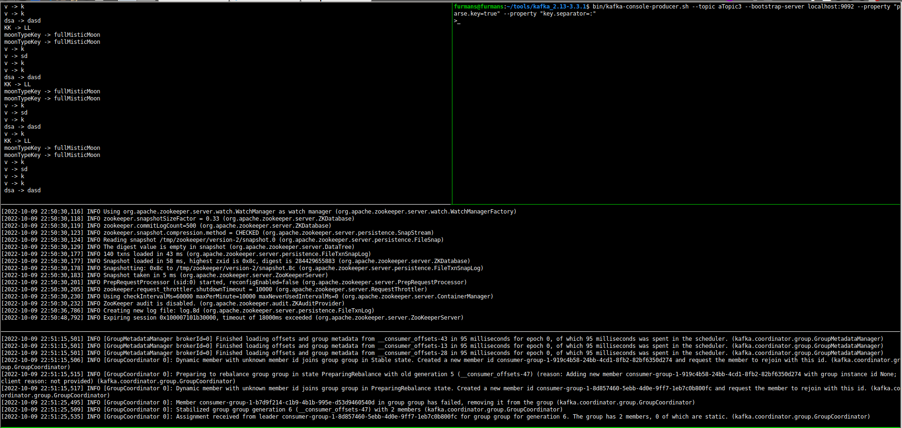

### Functional Kafka Streams for Scala - play around 

0. Download Apache Kafka https://kafka.apache.org/downloads

1. Run Zookeeper

```bash
bin/zookeeper-server-start.sh config/zookeeper.properties
```

2. Run Kafka 

```bash 
bin/kafka-server-start.sh config/server.properties
```

3. Run application

```bash
sbt run
```

4. Produce a message to a Kafka Topic

```bash
bin/kafka-console-producer.sh --topic aTopic3 --bootstrap-server localhost:9092 --property "parse.key=true" --property "key.separator=:"
```
notice1: aTopic3 is a Kafka Topic name which should be aligned with ServiceConfiguration.subscribeToTopicName (default value: aTopic3)
notice2: the key should be provided due to : `parse.key=true`
notice3: `key.separator` is set as `:`

Once the message is being consumed by the application, the same message is produced until terminated exceptionally or interrupted.




### Usage

Standard SBT project. You can compile code with `sbt compile`, run it with `sbt run`, and `sbt console` will start a Scala 3 REPL.

For more information on the sbt-dotty plugin, see the
[scala3-example-project](https://github.com/scala/scala3-example-project/blob/main/README.md).
